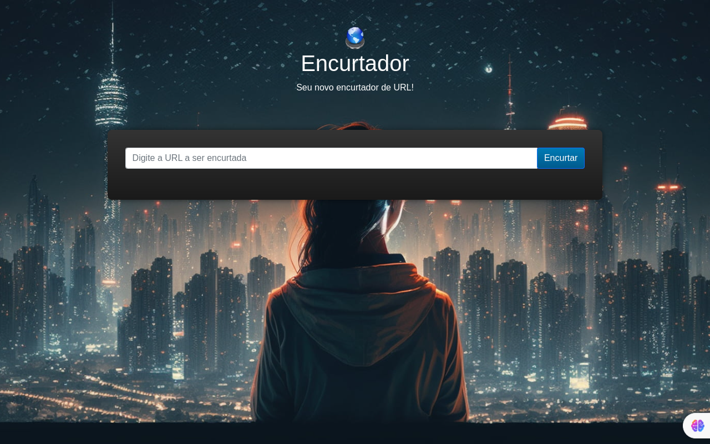

 <h1>Encurtador de URLs com Node.js</h1>

  
Bem-vindo ao Encurtador de URLs com Node.js! Este projeto é um encurtador de URLs simples e eficiente construído com Node.js, Express.js e SQLite. Ele permite que você encurte URLs longas, além de rastrear estatísticas de acesso para cada URL encurtada.

  <h2>Funcionalidades Principais:</h2>

  <ul>
    <li>Encurtamento de URLs: Gere URLs curtas e fáceis de lembrar.</li>
    <li>Estatísticas de Acesso: Acompanhe o número de visitas, última visita e mais.</li>
    <li>Interface Amigável: Uma interface de usuário simples e intuitiva.</li>
  </ul>

  <h2>Como Usar:</h2>

  
1. **Encurte sua URL:** Na página inicial, insira sua URL longa na caixa de texto e clique em "Encurtar".

  
2. **Acesse Estatísticas:** Cada URL encurtada possui uma página de estatísticas acessível por meio de `/:code/stats`.

  <h2>Executando Localmente:</h2>

  
1. Clone o repositório:

      git clone https://github.com/seu-usuario/encurtador-node.git
      

2. Instale as dependências:

festa 

    npm install

  
3. Execute a aplicação:

festa 

    npm start

  
Acesse a aplicação em (http://localhost:3000) no seu navegador.

  <h2>Tecnologias Utilizadas:</h2>
  <ul>
    <li>Node.js</li>
    <li>Express.js</li>
    <li>SQLite</li>
    <li>Bootstrap 5</li>
  </ul>
  <h2>Contribua!</h2>
  
Contribuições são bem-vindas! Sinta-se à vontade para abrir issues ou enviar pull requests para melhorar esta aplicação.

  <h2>Licença</h2>
  
Este projeto é licenciado sob a MIT License

  <h2>img</h2>
  
   
  
